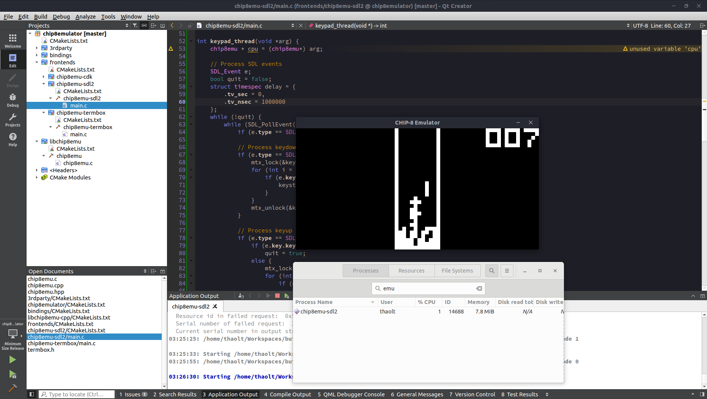

# chip8emu

A C99 implementation of CHIP8 emulation library

## Quick started

```
git clone https://github.com/thaolt/chip8emulator.git
cd chip8emulator
git submodule update --init
mkdir build && cd build
cmake ..
make
cd dist/
./chip8emu-termbox
```

## Multiple front-ends

### C99

* chip8emu-termbox
* chip8emu-sdl2
* chip8emu-cdk (planned)

### C++

* chip8emu-fltk (planned)

## Screencasts

[](https://asciinema.org/a/241423)

## Screenshots



## Credits

### Libraries Used

* Termbox: https://github.com/nsf/termbox
* TinyCThread: https://github.com/tinycthread/tinycthread
* log.c: https://github.com/rxi/log.c

### Other resources

Thanks to authors of the articles which help me writing this library

* http://www.multigesture.net/articles/how-to-write-an-emulator-chip-8-interpreter/
* http://en.wikipedia.org/wiki/CHIP-8
* http://devernay.free.fr/hacks/chip8/C8TECH10.HTM
