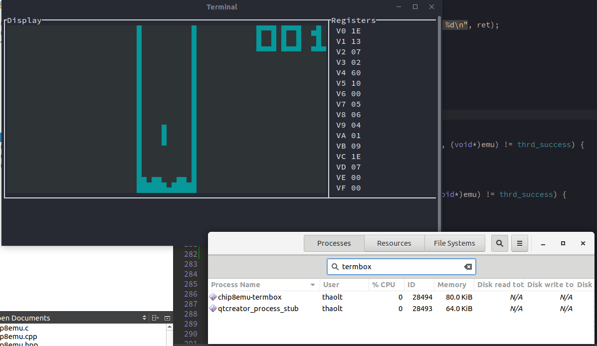

# chip8emu library

A lightweight, cross platform, C99 implementation of CHIP8 emulation library

## Quick started

```
git clone https://github.com/thaolt/chip8emulator.git
cd chip8emulator
git submodule update --init
mkdir build && cd build
cmake ..
make
cd dist/
./chip8emu-termbox
```

## Multiple front-ends

**C99**

* chip8emu-termbox
* chip8emu-sdl2
* chip8emu-cdk (planned)

**C++**

* chip8emu-fltk (planned)

[**How to write your own chip 8 emulator**](libchip8emu#how-to-write-your-own-emulator)

## Related projects

* [Chip8EMU Handheld](https://github.com/thaolt/chip8emu-handheld)

## Screencasts

[](https://asciinema.org/a/241423)

## Screenshots


SDL2 | Termbox
--- | --- 
 | 

## Thanks and credits

### Bundled ROMS

Downloaded from https://www.zophar.net/pdroms/chip8/chip-8-games-pack.html


### Libraries Used

* Termbox: https://github.com/nsf/termbox
* TinyCThread: https://github.com/tinycthread/tinycthread
* log.c: https://github.com/rxi/log.c

### Other resources

Thanks to authors of the articles which help me writing this library

* http://www.multigesture.net/articles/how-to-write-an-emulator-chip-8-interpreter/
* http://en.wikipedia.org/wiki/CHIP-8
* http://devernay.free.fr/hacks/chip8/C8TECH10.HTM

Specials thanks to the [Awesome C](https://github.com/kozross/awesome-c) listing. It's an awesome list of awesome open-source software and libraries written in C, yeah that's a lot of awesome. It was where I found libraries that used in libchip8emu, everyone should check it out.
